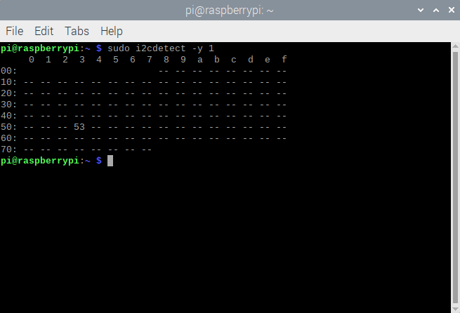

# ADXL343 software setup

Note: I mostly followed this guide: [https://learn.adafruit.com/adxl343-breakout-learning-guide/circuitpython](https://learn.adafruit.com/adxl343-breakout-learning-guide/circuitpython)

Before we can install our ADXL343 package from [this GitHub repository](https://github.com/adafruit/Adafruit_CircuitPython_ADXL34x), we need CircuitPython and the bus device libraries. You probably already have the former from earlier (`basic_software_setup.md`), but for the sake of completeness, feel free to check. You definitely need to have `pip3` (the package manager for Python 3) installed to run these commands, but that tutorial should have taken care of that too.

Here's [the repository for the bus devices libraries](https://github.com/adafruit/Adafruit_CircuitPython_BusDevice) if you want to check it out yourself, but basically, you just have to run `pip3 install adafruit-circuitpython-busdevice`.

Then, we can circle back to the ADXL34x repository (linked above), but you just have to run `pip3 install adafruit-circuitpython-adxl34x`.

Before you continue with this setup, make sure you've soldered your accelerometers to breakout pins. **(More generally, you should take a look at `adxl343_hardware_setup.md`.)** Otherwise, you'll run into the same issues I did below with trying to set up the sensors' REPL (read-evaluate-print-loop). I never got around to doing this successfully, but I don't think we need to do this. I was also trying to do this without having properly soldered my sensors. Therefore, the below section is just for documentation purposes.

## Attempting to set up REPL (documentation purposes only)

I first looked for which serial port corresponded to the board. The output of `ls /dev/tty*` on the Pi with a single ADXL343 "connected" (it wasn't actually properly connected) was:

```
pi@raspberrypi:~ $ ls /dev/tty*
/dev/tty    /dev/tty19  /dev/tty3   /dev/tty40  /dev/tty51  /dev/tty62
/dev/tty0   /dev/tty2   /dev/tty30  /dev/tty41  /dev/tty52  /dev/tty63
/dev/tty1   /dev/tty20  /dev/tty31  /dev/tty42  /dev/tty53  /dev/tty7
/dev/tty10  /dev/tty21  /dev/tty32  /dev/tty43  /dev/tty54  /dev/tty8
/dev/tty11  /dev/tty22  /dev/tty33  /dev/tty44  /dev/tty55  /dev/tty9
/dev/tty12  /dev/tty23  /dev/tty34  /dev/tty45  /dev/tty56  /dev/ttyAMA0
/dev/tty13  /dev/tty24  /dev/tty35  /dev/tty46  /dev/tty57  /dev/ttyprintk
/dev/tty14  /dev/tty25  /dev/tty36  /dev/tty47  /dev/tty58  /dev/ttyS0
/dev/tty15  /dev/tty26  /dev/tty37  /dev/tty48  /dev/tty59
/dev/tty16  /dev/tty27  /dev/tty38  /dev/tty49  /dev/tty6
/dev/tty17  /dev/tty28  /dev/tty39  /dev/tty5   /dev/tty60
/dev/tty18  /dev/tty29  /dev/tty4   /dev/tty50  /dev/tty61
```

Next, I shut down the Pi. (An aside about disconnecting and reconnecting sensors: even after you've shut down the Pi, disconnect the power (for me, that's my USB-C) before messing with the sensors. I forgot to disconnect the cable before re-plugging in the sensor, and as I was plugging in the jumper wire into the breadboard, my RPi decided to start up again. I'm not sure if it was caused by what I was doing, but don't take any chances.) I disconnected the ADXL343 and restarted; here's the output of the same command. (The order in which I did this doesn't matter; I just happened to start with having the accelerometer already connected.)

```
pi@raspberrypi:~ $ ls /dev/tty*
/dev/tty    /dev/tty19  /dev/tty3   /dev/tty40  /dev/tty51  /dev/tty62
/dev/tty0   /dev/tty2   /dev/tty30  /dev/tty41  /dev/tty52  /dev/tty63
/dev/tty1   /dev/tty20  /dev/tty31  /dev/tty42  /dev/tty53  /dev/tty7
/dev/tty10  /dev/tty21  /dev/tty32  /dev/tty43  /dev/tty54  /dev/tty8
/dev/tty11  /dev/tty22  /dev/tty33  /dev/tty44  /dev/tty55  /dev/tty9
/dev/tty12  /dev/tty23  /dev/tty34  /dev/tty45  /dev/tty56  /dev/ttyAMA0
/dev/tty13  /dev/tty24  /dev/tty35  /dev/tty46  /dev/tty57  /dev/ttyprintk
/dev/tty14  /dev/tty25  /dev/tty36  /dev/tty47  /dev/tty58  /dev/ttyS0
/dev/tty15  /dev/tty26  /dev/tty37  /dev/tty48  /dev/tty59
/dev/tty16  /dev/tty27  /dev/tty38  /dev/tty49  /dev/tty6
/dev/tty17  /dev/tty28  /dev/tty39  /dev/tty5   /dev/tty60
/dev/tty18  /dev/tty29  /dev/tty4   /dev/tty50  /dev/tty61
```

Nothing had changed-- I should have realized from this that my sensor wasn't properly connected (I hadn't soldered it), but I opted to just ignore this and move on.

## Detecting the sensor

With a single ADXL343 (connected to the default I2C bus), you can check that the Pi successfully detects the sensor's presence with `sudo i2cdetect -y 1`. Here's what that looks like when successful:



(Sorry about mixing screenshots and code-block output together. I'll try to clean this up and make it consistent in the future.)

If it's unsuccessful, the `53` in the output will be replaced by `--`.

Okay, now what? How can the sensor talk to the Pi via Python? We can use some sample code (which is also in Adafruit's tutorial); for convenience, it's under the `files` folder (here) as `i2c.py`. It just creates the acclerometer object, continually queries its accleration, and prints it.

Your terminal output will just be a sequence of three doubles, reflecting the accelerations of each of the sensor's axes.

## Attempting to detect the sensor (documentation purposes only)

When I first ran this with an ADXL343 connected (after failing to set up REPL), unsurprisingly, it didn't work. Again, I hadn't yet soldered *anything*. But here's the error message I got:

```python
Traceback (most recent call last):
  File "/home/pi/Desktop/i2c.py", line 6, in <module>
    accelerometer = adafruit_adxl34x.ADXL343(i2c)
  File "/home/pi/.local/lib/python3.9/site-packages/adafruit_adxl34x.py", line 174, in __init__
    self._i2c = i2c_device.I2CDevice(i2c, address)
  File "/home/pi/.local/lib/python3.9/site-packages/adafruit_bus_device/i2c_device.py", line 50, in __init__
    self.__probe_for_device()
  File "/home/pi/.local/lib/python3.9/site-packages/adafruit_bus_device/i2c_device.py", line 163, in __probe_for_device
    raise ValueError("No I2C device at address: 0x%x" % self.device_address)
ValueError: No I2C device at address: 0x53
```

I thought perhaps that the fact that I had the T-cobbler and the acclerometer on the same breadboard was the problem:

> About (physically) setting up the accelerometer:
> 
> I'm not sure why, but whenever I've tried to wire the accelerometer on the same breadboard as my T-cobbler, the RPi wouldn't be able to detect it (for example, via `i2cdetect -y 1`).
> 
> This is *supposed* to work, but regardless, we can sidestep the issue by wiring the accelerometer to a mini breadboard or something similar. I haven't soldered anything yet, so I directly placed the jumper wires through the pinouts on the sensor and secured the sensor to a piece of orange foam. Surprisingly enough, it works. That said, you need to be sure not to jostle or detach any of the connections, as that'll (unsafely, I think) disconnect the sensor from the system.
>
> (Each time I accidentally did this, my entire RPi system became unable to run *anything*, regardless of whether it was directly related to the sensor. I got error messages about the SD card being "removed" from the system, I was unable to shut down normally, run any CLI commands, and so on.)

I was just completely off on my "orange foam" workaround, but that last bit *is* good to know: don't mess with wires and sensor connections while the Pi is on. Otherwise, you'll probably have to force it to shut down (probably by removing the power cable).