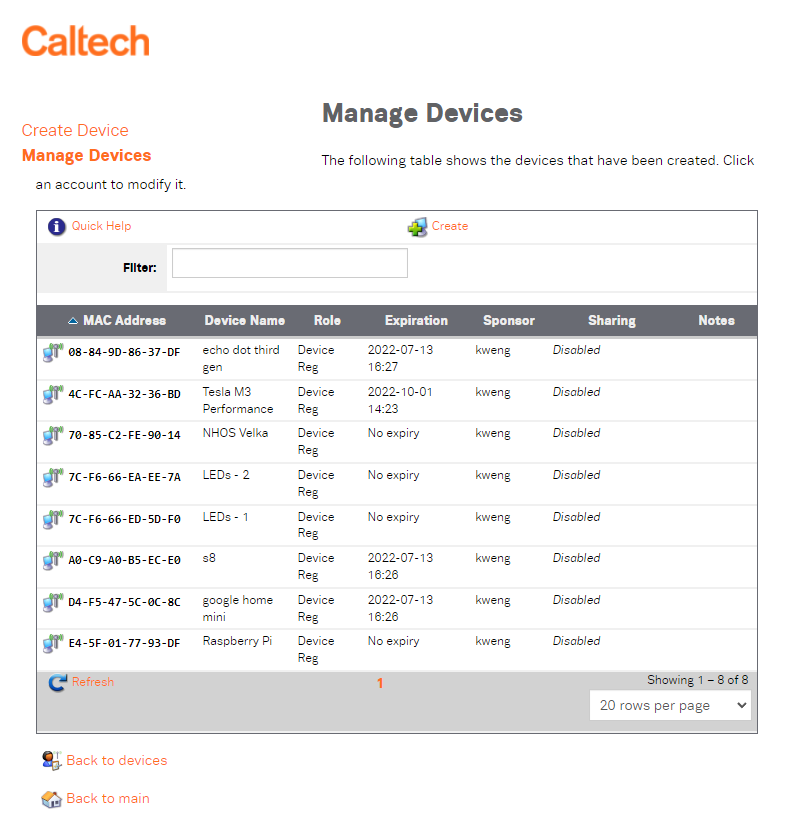

# Connecting your Pi to the internet
When it comes to connecting to the Internet, we have two options. Wired ethernet is the easiest (just plug in a cable into the appropriate port on the RPi), but you might not want that because of the additional cable clutter it adds to your setup. I went with wi-fi, so I'll share that process here.

Make sure you connect to a network that *doesn't* have 802.1x EAP security. Basically, if the wifi network asks you for a username and a password, the RPi can't connect to it. If you're a college student, this will probably rule out your usual wi-fi network. In that case, you should look for whatever wi-fi network your school allows students to use for connecting IoT devices (for instance, Echo Dots, Google Homes, and those fancy LED strips that connect to the Internet).

## Getting the MAC address
We can connect our Pi to the Caltech Visitor network. To do that, though, we'll need its MAC address. Open a terminal window and run `ifconfig`. You'll get multiple blocks of text as output; each corresponds to a network interface:

Here, `eth0` is the ethernet interface (your Pi has an ethernet port that uses this), `lo` is the loopback interface (used for testing services; the loopback address is also called the "localhost"), and `wlan0` is the wireless interface. The MAC address is just the chunk of alphanumeric text right after `ether` with colons sprinkled around. `eth0` and `wlan0` have different MAC addresses, so make sure you're looking in the right place. In this case, the MAC address that I want to use is `e4:5f:01:77:93:df`.

## Whitelisting the Pi - Caltech-specific

We can use the Caltech Visitor network to whitelist devices that 1) we want to connect to the Internet and 2) don't support username and password authentication. Go to [https://cp1.caltech.edu/guest/auth_login.php](https://cp1.caltech.edu/guest/auth_login.php) and log in with your access.caltech credentials. You'll see this page:

If this is your first time accessing this page, though, you probably won't have any listed devices. Click the "create" button and input your device information (replace the colons in your MAC address with dashes-- this is just a matter of convention):

Side note: you should probably specify an account expiry date for security purposes, but if you don't want to, you can select "Account expires at specified time" as your expiration date-- then, the device entry will never expire.

Now, your Pi should be able to connect to the Caltech visitor network without your needing to jump through the non-Caltech hoops (ie., make a guest account that expires after a day).