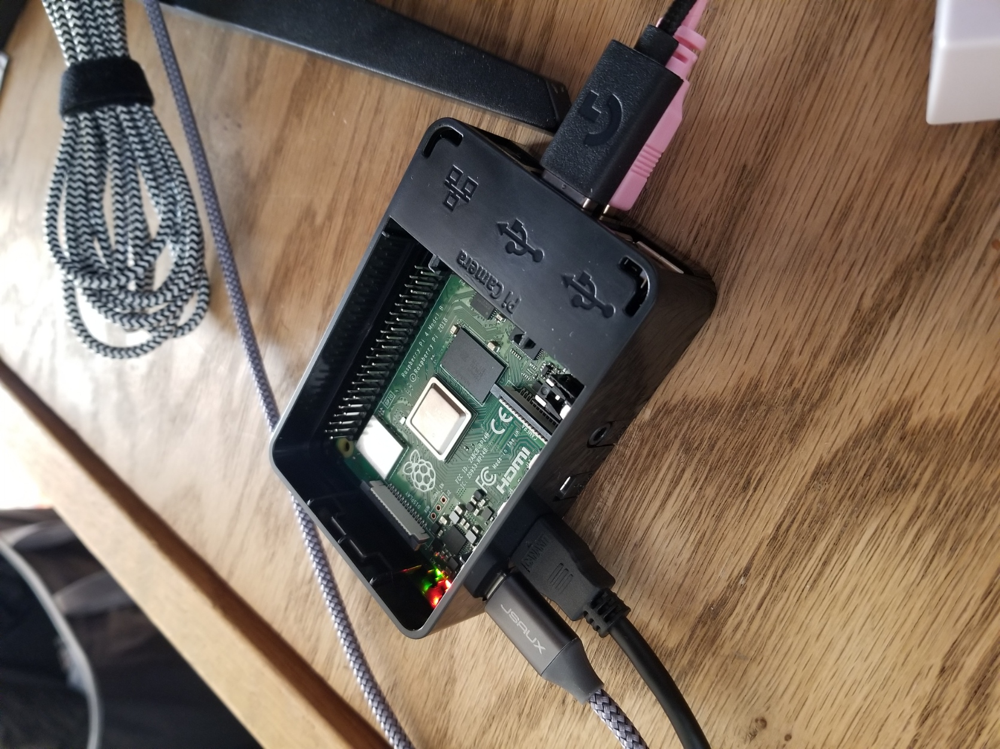
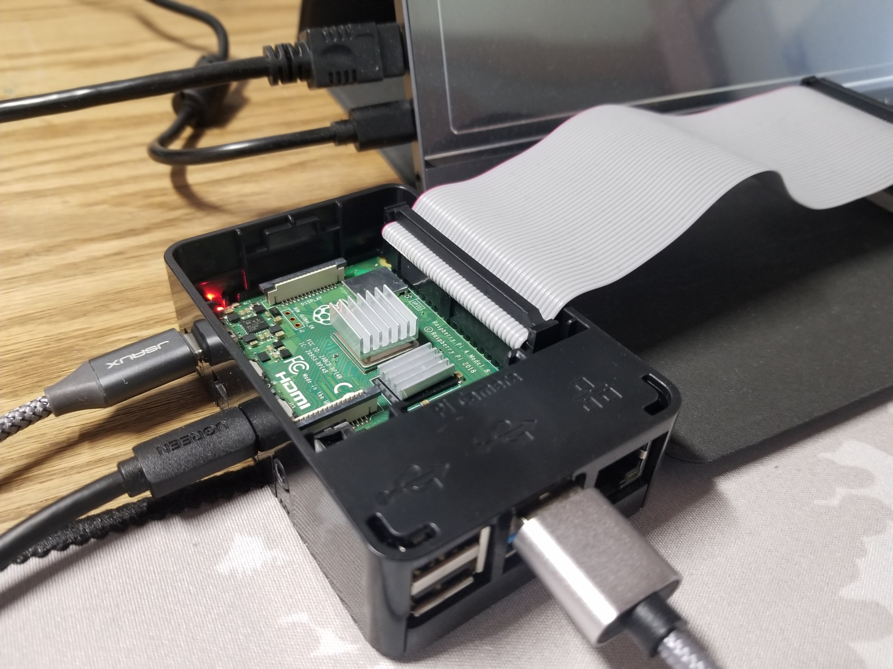

# Pi hardware setup

When you first boot up your Pi, at a minimum, it should look something like this:

The black plastic case is (obviously) not necessary, but the USB-A cables (the full-sized ones) on the right hand side are for my mouse and keyboard. (One of the first things I did upon booting my Pi for the first time was to set up a Bluetooth mouse, since I have too much wire clutter on my desk.) The gray cable on the left side is a USB-C cable for power, and the black cable next to that is a micro-HDMI (not mini-HDMI) cable. (It's a micro-HDMI male to HDMI male cable, so it terminates in a normal HDMI cable.) All you need to get started with the Pi is power, a display output, and input methods. Don't forget to also have a method of powering your display output.

You'll have to connect a T-cobbler to the Pi at some point, though:

(There are heatsinks on some of the chips on the Pi in this picture. They're optional, but they came with my Canakit bundle and they give me some peace of mind.)

On the other end of the T-cobbler is an array of breadboards and sensors, so see `adxl343_hardware_setup` on how to get that up and running.