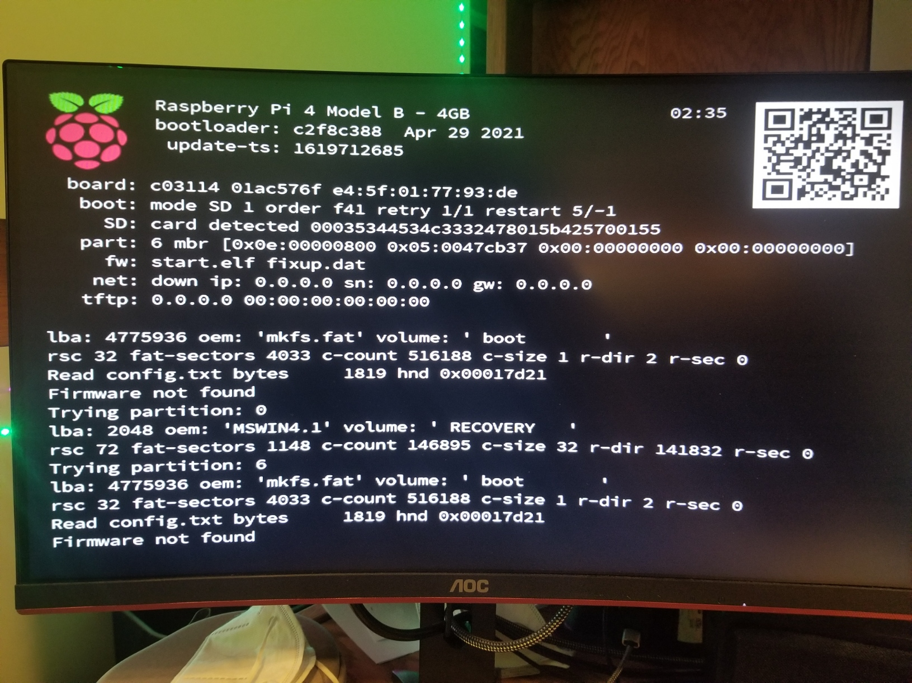
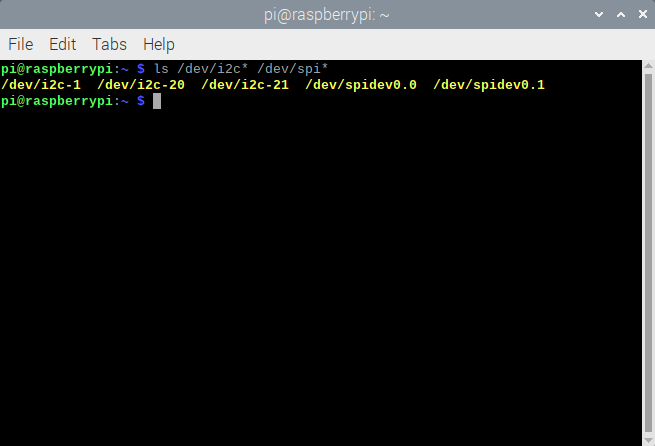
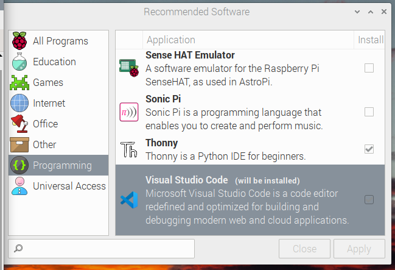

# Pi software setup

Notes:
1. I'll likely assume some level of terminal familiarity, but I'll try to drop hints wherever I remember to.
2. Most of this is also covered on [https://learn.adafruit.com/circuitpython-on-raspberrypi-linux/installing-circuitpython-on-raspberry-pi](https://learn.adafruit.com/circuitpython-on-raspberrypi-linux/installing-circuitpython-on-raspberry-pi) and many other places on the Internet.

## Update and upgrade packages

Run `sudo apt-get update` to update the local copy of the database of available software on your Pi. Then, run `sudo apt-get upgrade` to update the packages that are installed on your system.

(First timers: `sudo` means that you're running the rest of the command as a superuser. You probably won't have to authenticate yourself because the user you're logged into on the Pi should be the sole account and the sole administrator, but on other Linux systems, you will probably have to. Also, when running `sudo apt-get upgrade`, make sure to confirm that yes, you do want to update your installed packages.)

Then, install pip (`sudo apt-get install python3-pip`), another package manager, and update setuptools via pip (`sudo pip3 install --upgrade setuptools`).

After that, feel free to install your browser of choice. I'm used to Chrome on my other devices, so I installed Chromium (the open-source version of Chrome that's free of Google's telemetry): `sudo apt install chromium-browser -y`

## CircuitPython

Now, we can install CircuitPython, which has all of the necessary libraries for our Pi to talk to our sensors in Python. I copied the below script from the above adafruit tutorial, so you should be fine if you just copy, paste, and run this. (Note that control/command + v does not work as a paste shortcut in the linux terminal. You can use shift + control + v or right-click and select "paste".)

```bash
cd ~
sudo pip3 install --upgrade adafruit-python-shell
wget https://raw.githubusercontent.com/adafruit/Raspberry-Pi-Installer-Scripts/master/raspi-blinka.py
sudo python3 raspi-blinka.py
```

It'll take a while to run-- **make sure you don't mess with the terminal process**. I thought my script had somehow frozen (since the terminal hadn't shown any new progress in ~10 minutes), so I killed the process (with control + c). (In retrospect, though, the process had *already* taken quite a while before I killed it, indicating that something might have gone wrong behind the scenes. On my second try, CircuitPython installed successfully in a matter of minutes.) After I rebooted my Pi, I got this somewhat intimidating screen:



Then, I had to re-flash my Pi and start from the beginning. You can check out `reflashing.md` to see what I did.

Anyways, after CircuitPython is successfully installed, you can verify that I2C and SPI (communication interfaces) are enabled with `ls /dev/i2c* /dev/spi*`. I got slightly different output than what the adafruit tutorial shows, but no worries-- `/dev/i2c-1`, `/dev/spidev0.0`, and `/dev/spidev0.1` are still in the output:



We're not using SPI to talk to our sensors, so bother with enabling the other SPI port.

The Adafruit tutorial has a snippet of python code we can run to confirm that everything software-wise is okay so far:

```python
import board
import digitalio
import busio

print("Hello blinka!")

# Try to great a Digital input
pin = digitalio.DigitalInOut(board.D4)
print("Digital IO ok!")

# Try to create an I2C device
i2c = busio.I2C(board.SCL, board.SDA)
print("I2C ok!")

# Try to create an SPI device
spi = busio.SPI(board.SCLK, board.MOSI, board.MISO)
print("SPI ok!")

print("done!")
```

If you're tired of copy-pasting things, this is the `blinkatest.py` file (same directory as this file). It ran successfully for me on the first try, but if it doesn't for you, I'd honestly just try reinstalling CircuitPython.

(First timers: you can copy-paste the above code into a file, save it as a `.py` file, navgiate to its location with `ls`, and run it with `python3 [your_file_name].py`. Or you can download `blinkatest.py`, navigate to it, and run it with `python3 blinkatest.py`. Again, no real difference.)

## Visual Studio Code

So that's all you need to hit the ground running (with one accelerometer-- we'll visit the issue of multiple sensors shortly). However, you should also install an IDE you're comfortable with. I think the default python IDE on the Pi is a little ugly, so I'm just going to use Microsoft's VSCode. There are many ways to install this, but from the start menu (raspberry logo, upper-left hand corner of screen), you can navigate to Preferences and then Recommended Software. Then, navigate to the Programming menu (on the left hand side of the window), check the box next to Visual Studio Code, and apply your changes:

