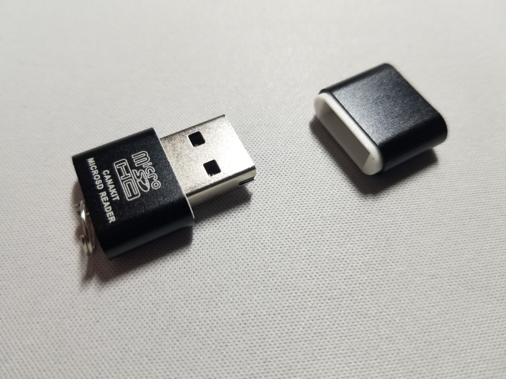
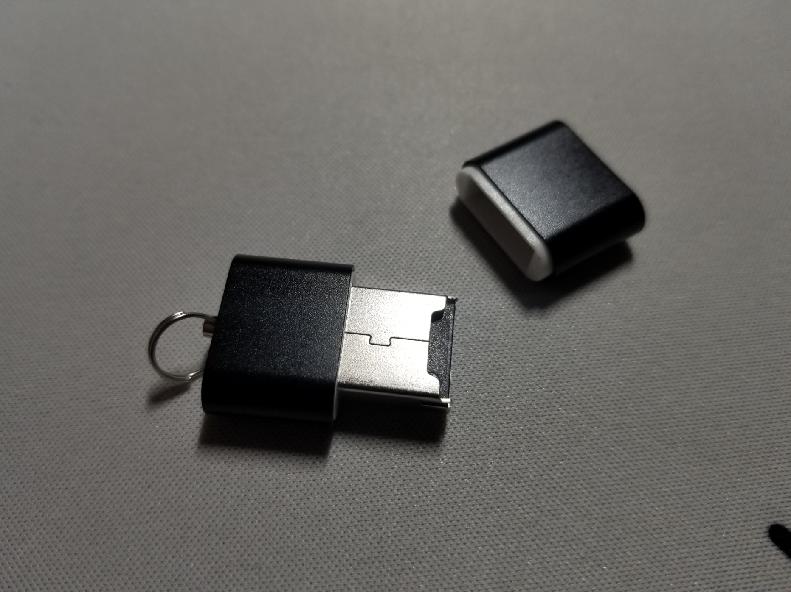
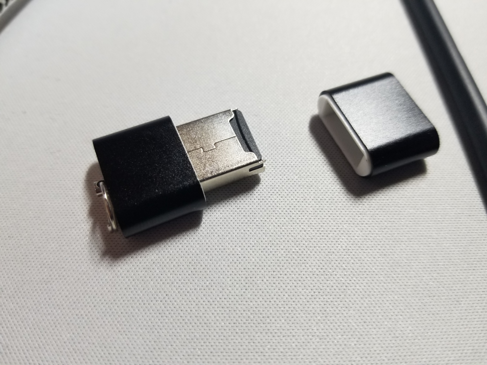
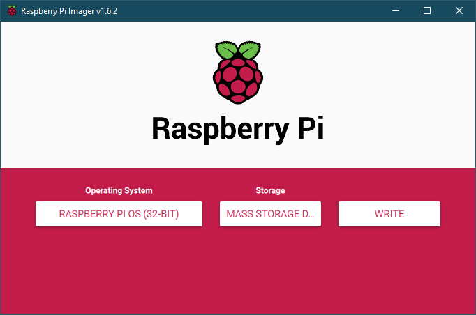

# Reflashing the Pi
You'll probably need to do this if you can't boot to the desktop. I had a "firmware not found" error message:

## Formatting

I got my Pi from Canakit, so I initially looked at their paper guide to figure out what to do. If you're in the same spot, though, you should probably ignore that guide; it's not the easiest solution. Instead, **on another computer** (since you can't safely modify the RPi's system files while you're using it, and besides, it's non-functional), you can do one of two things:
1. Download the SD Associaton's card formatter: [https://www.sdcard.org/downloads/formatter/](https://www.sdcard.org/downloads/formatter/). This probably isn't necessary, since most devices can format drives on their own nowadays. Nonetheless, it won't hurt.
2. Format the card using a system application like macOS's Disk Utility or perhaps the command line/terminal (I've not tried either, though).

By the way, make sure your microSD card is plugged into a microSD to USB adapter, since very few computers actually have SD (let alone micro SD) ports these days. Here's the one was part of my Canakit bundle, although there are better-designed ones (that are also faster by way of USB 3.0 support) out there:

For this particular one, I had to slot in the micro SD on the underside of the USB. The fit felt and looked a little sketchy to me (it was also a hassle to remove the SD card), but it worked.

If you have this particular adatper, don't bother trying to get the micro SD to sit flush in the USB. It *will* stick out, and it won't look any better than that.

I tried formatting the microSD card on my personal Windows system, but that just lead to various complications. Whenever I plugged in my adapter, the drive would still properly show up in File Explorer, but my entire system would slow down-- moreso if I actually tried to access the files in the SD card. I ended up having to force shut down my PC multiple times (ie., hold down the power button) before I figured out that Windows wasn't playing nicely with the corrupt SD card. My format attempts all failed, presumably because Windows was (for whatever reason?) trying to read the card's files before wiping it. After Googling around, I found that my problems were consistent with [someone else's](https://www.reddit.com/r/techsupport/comments/m816b7/corrupt_microsd_card_no_success_formatting_in_any/) as well. So I wouldn't try formatting a corrupt SD card (or any drive, for that matter) on a Windows machine. I didn't have a Mac or Linux machine handy, so I passed my SD card off to a friend who formatted it for me. At any rate, if you're doing this yourself, **make sure you use a method that doesn't attempt to read the corrupt card**; you'll save yourself a lot of headache.

## Reflashing

Then, **on that computer** (similarly, you can't use your RPi to flash its own SD card), install the Raspberry Pi Imager: [https://www.raspberrypi.com/software/](https://www.raspberrypi.com/software/). Select your operating system to install (Raspberry Pi OS, 32-bit) and your storage (ie., your freshly formatted SD card); then, you're pretty much home free.

